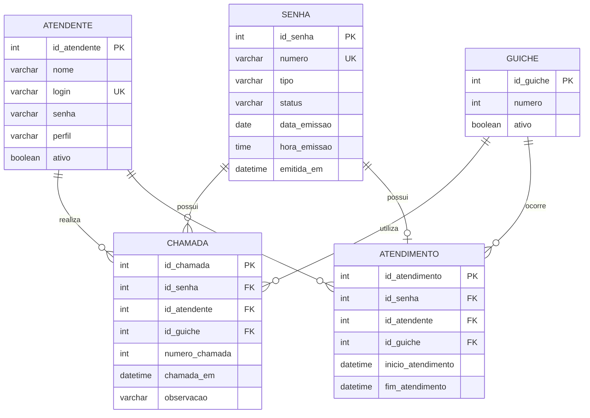

# Modelo Entidade-Relacionamento — nassauTickets

## Diagrama MER

## Entidades

### ATENDENTE

Representa o funcionário responsável por realizar os atendimentos no sistema.

### GUICHE

Representa o guichê utilizado pelo atendente durante o atendimento.

### SENHA

Representa a senha emitida pelo totem para o cliente.

Tipos de senha:

- SP — Senha Prioritária
- SG — Senha Geral
- SE — Senha para retirada de Exames

### CHAMADA

Registra cada chamada realizada pelo atendente para uma determinada senha.

Uma senha pode ser chamada mais de uma vez.

### ATENDIMENTO

Registra o atendimento efetivamente iniciado e finalizado pelo atendente.

## Estados da senha

A senha deverá seguir a seguinte sequência:

EMITIDA  
↓  
AGUARDANDO  
↓  
CHAMADA  
↓  
CHAMADA_NOVAMENTE  
↓  
EM_ATENDIMENTO  
↓  
ATENDIDA

Também poderá assumir o estado:

NÃO_COMPARECEU